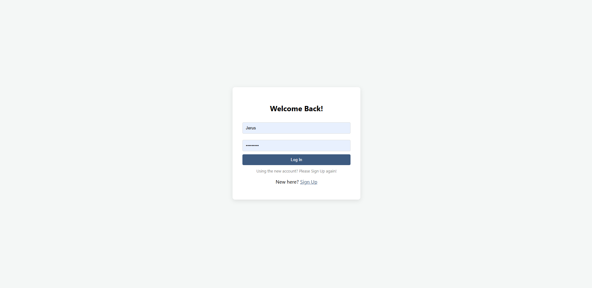
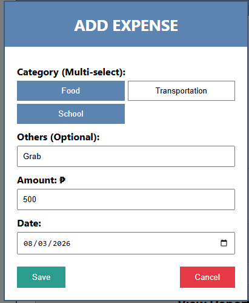
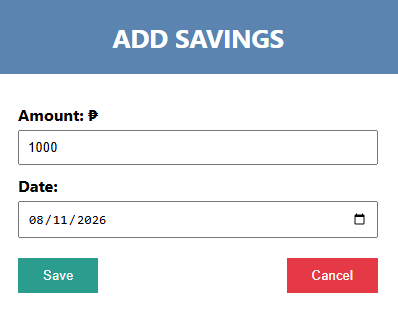
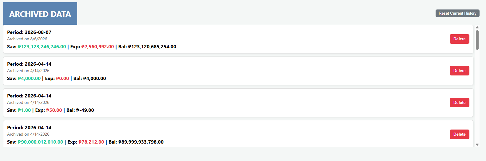

# Friendly Budgeting Tracker

A web-based budgeting application developed to help students effectively manage their daily finances. The system enables users to track income, expenses, savings, and financial reports through a simple and user-friendly interface.


# Overview

Friendly Budgeting Tracker was created to promote financial literacy among students by providing an easy-to-use budgeting system. Many students find it difficult to manage their daily allowance and expenses. This application helps users record their financial activities and monitor their spending habits.

As part of our project, we demonstrated the application to students to showcase how technology can assist in personal financial management. The demonstration allowed students to experience the system and understand the importance of budgeting and saving.


# Features

*  Dashboard Overview
*  Income Tracking
*  Expense Tracking
*  Savings Management
*  Financial Reports
*  User Registration and Login
*  Responsive User Interface
*  Transaction History


# Technologies Used

## Frontend

* HTML5
* CSS3
* JavaScript

## Backend

* Node.js
* Netlify Functions
* Netlify Blobs

## Deployment

* Netlify
* Vercel

## Version Control

* Git
* GitHub


# Project Structure

```text
Friendly-Budgeting-Tracker/
│── netlify/
│   └── functions/
│── public/
│── assets/
│── css/
│── js/
│── package.json
│── package-lock.json
│── netlify.toml
│── vercel.json
│── README.md

```


# Installation

Clone the repository

```bash
git clone https://github.com/YOUR_USERNAME/Friendly-Budgeting-Tracker.git
```

Go to the project directory

```bash
cd Friendly-Budgeting-Tracker
```

Install the dependencies

```bash
npm install
```

Run the project

npm start
```


#  How the System Works

1. Users create an account or log in.
2. Users enter their available income or allowance.
3. Daily expenses are recorded and categorized.
4. Savings can be added whenever money is set aside.
5. The dashboard automatically summarizes financial activities.
6. Reports help users analyze spending patterns and monitor their savings.


# Objectives

* Help students manage their daily allowance.
* Encourage responsible spending habits.
* Promote saving and financial planning.
* Provide an easy-to-use budgeting application.
* Improve financial awareness among students.


#  Project Demonstration

The Friendly Budgeting Tracker was demonstrated to students as part of our academic project. During the presentation, participants explored the application's features, including user registration, income recording, expense tracking, savings management, and financial reports.

The demonstration aimed to:

* Introduce students to practical budgeting techniques.
* Show how technology can simplify financial management.
* Encourage students to save money and monitor their expenses.
* Increase awareness of responsible financial decision-making.

The feedback gathered from the demonstration helped evaluate the usability and effectiveness of the application in supporting students' budgeting needs.

# Screenshots

## Login



## Expenses



## Savings



## Reports



🔮 Future Improvements

* Budget Categories
* Monthly Budget Goals
* Email Notifications
* Export Reports as PDF
* Dark Mode
* Mobile Application
* Cloud Data Backup
---

 🤝 Contributing

Contributions are welcome.

1. Fork the repository.
2. Create a feature branch.
3. Commit your changes.
4. Push your branch.
5. Open a Pull Request.


 License

This project was developed for educational purposes. It may be used, modified, and improved for learning and non-commercial use.


  Acknowledgements

We would like to thank our instructors, classmates, and the students who participated in our project demonstration. Their feedback and support helped us improve the Friendly Budgeting Tracker.

 
